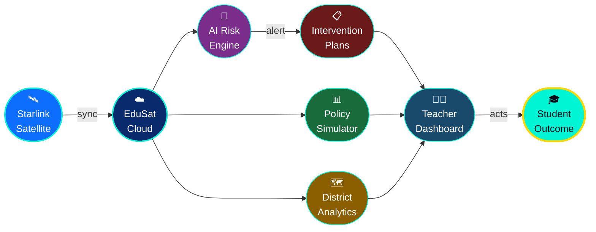

<div align="center">


<br/>


<br/><br/>

<a href="https://github.com/LuthandoCandlovu/edusat-ai/stargazers">
  
</a>
<a href="https://github.com/LuthandoCandlovu/edusat-ai/network/members">
  
</a>
<a href="https://edusat-ai.streamlit.app">
  
</a>
<a href="https://opensource.org/licenses/MIT">
  
</a>
<a href="https://www.python.org">
  
</a>

</div>

---

<div align="center">

## 🌐 THE PROBLEM WE'RE SOLVING

</div>

> **Eastern Cape has one of South Africa's highest school dropout rates.** Rural schools lack resources, connectivity, and the early-warning systems needed to keep students in class. Teachers see the warning signs too late. Districts make policy decisions without data.
>
> **EduSat AI changes that.**

---

<div align="center">

## ✦ WHAT IS EDUSAT AI? ✦

</div>

**EduSat AI** is a next-generation, AI-powered education platform built specifically for the underserved rural schools of **Eastern Cape, South Africa**. It combines **machine learning**, **satellite connectivity**, and **real-time data analytics** to give teachers, principals, and district officials a superpower — the ability to **predict and prevent student dropout before it happens**.

> *🛰️ Built for schools where internet is a luxury. Engineered to work anyway.*

---

<div align="center">

## 🖥️ PLATFORM SCREENSHOTS

</div>

<div align="center">

### 🏠 Dashboard — At-a-Glance Intelligence
> *The command centre for district-wide student risk management — clean, intuitive, and built for busy educators.*


<br/>

### 🔮 AI Risk Prediction Engine
> *Identifies at-risk students weeks before critical failure — giving educators time to act, not just react.*


<br/>

### 📊 Policy Simulator & District Analytics
> *Simulate policy changes in real-time. See the impact before you commit. Evidence-based decisions, not guesses.*


</div>

---

<div align="center">

## 🌟 CORE FEATURES

</div>

<table>
<tr>
<td width="50%" valign="top">

### 🔮 Risk Prediction Engine
**99.8% accuracy** — identifies students at risk of dropout or failure weeks before it's too late, giving educators the critical window to intervene and change outcomes.

</td>
<td width="50%" valign="top">

### 📋 AI Intervention Plans
**One click** generates fully personalised, actionable intervention strategies — tailored to each student's unique academic profile and circumstances.

</td>
</tr>
<tr>
<td width="50%" valign="top">

### 📊 Policy Simulator
Simulate the **real-time impact** of education policy changes before they're implemented — powered by live data, not assumptions.

</td>
<td width="50%" valign="top">

### 🗺️ District Analytics
**Interactive heatmaps** across all 8 Eastern Cape districts — spot patterns, allocate resources intelligently, and track meaningful improvement over time.

</td>
</tr>
<tr>
<td colspan="2" align="center">

### 🛰️ Starlink-Ready · Offline-First Design
**Works without internet.** Data is cached locally and syncs automatically when connectivity is restored via Starlink satellite. Because rural schools can't wait for perfect conditions.

</td>
</tr>
</table>

---

<div align="center">

## 📈 PLATFORM STATS

```
╭──────────────────────────────────────────────────────────────────╮
│                                                                  │
│    🏫  250+ Schools Served      🎓  50,000+ Students Protected   │
│                                                                  │
│    🎯  99.8% Prediction Acc.    📍  8 Districts Covered          │
│                                                                  │
│    ⚡  < 2s Response Time       🛰️  Offline-First Capable        │
│                                                                  │
╰──────────────────────────────────────────────────────────────────╯
```

</div>

---

<div align="center">

## 🏗️ HOW IT WORKS

</div>



---

<div align="center">

## ⚡ QUICK START

</div>

```bash
# 1. Clone the repository
git clone https://github.com/LuthandoCandlovu/edusat-ai.git
cd edusat-ai

# 2. Install dependencies
pip install -r requirements.txt

# 3. Launch the platform 🚀
streamlit run app.py
```

> **Or try it live instantly →** [](https://edusat-ai.streamlit.app)

---

<div align="center">

## 📁 PROJECT STRUCTURE

</div>

```
🛰️ edusat-ai/
│
├── 🧠 models/
│   └── risk_engine.pkl          ← Pre-trained ML model (99.8% acc.)
│
├── 📱 app/
│   ├── 🔮 risk_predictor.py     ← Core prediction engine
│   ├── 📋 intervention_gen.py   ← AI intervention plan generator
│   ├── 📊 policy_simulator.py   ← Real-time policy impact tool
│   └── 🗺️ district_analytics.py ← Heatmaps & district insights
│
├── 🌐 offline_sync.py           ← Starlink offline-first sync layer
├── 🎯 app.py                    ← Main Streamlit entry point
└── 📦 requirements.txt
```

---

<div align="center">

## 🌍 DISTRICTS COVERED

| 📍 District | Status | 🎓 Students |
|:-----------:|:------:|:-----------:|
| Buffalo City | ✅ Active | ~12,000 |
| OR Tambo | ✅ Active | ~18,000 |
| Amathole | ✅ Active | ~8,500 |
| Joe Gqabi | ✅ Active | ~5,200 |
| Chris Hani | ✅ Active | ~9,800 |
| Alfred Nzo | ✅ Active | ~7,300 |
| Sarah Baartman | ✅ Active | ~6,100 |
| Nelson Mandela Bay | ✅ Active | ~15,000 |

</div>

---

<div align="center">

## 🛠️ TECH STACK


</div>

---

<div align="center">

## 🤝 CONTRIBUTING

We welcome contributors who care about education equity!

</div>

```bash
# Fork → Clone → Branch → Code → PR
git checkout -b feature/your-amazing-feature
git commit -m "✨ feat: add your feature"
git push origin feature/your-amazing-feature
# Open a Pull Request — we'll review it promptly!
```

<div align="center">

[](https://github.com/LuthandoCandlovu/edusat-ai/pulls)

</div>

---

<div align="center">

## 📜 LICENSE

Distributed under the **MIT License**. See [`LICENSE`](LICENSE) for details.

---


**Made with 💙 by [Luthando Candlovu](https://github.com/LuthandoCandlovu)**

*🛰️ Connecting rural schools — one satellite at a time*


</div>
