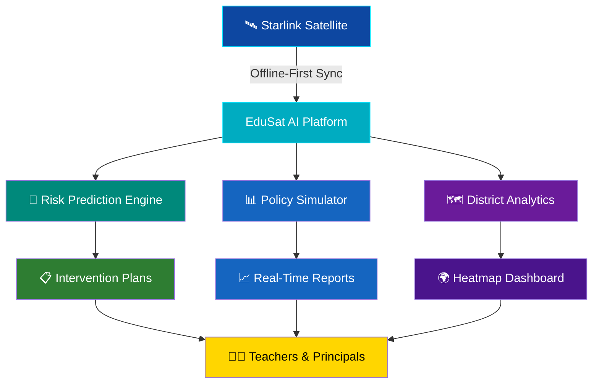

<div align="center">

<!-- Animated Banner SVG -->


<!-- Typing Animation -->
<a href="https://git.io/typing-svg">
  
</a>

<br/>

<!-- Badges Row 1 -->
[](https://github.com/LuthandoCandlovu/edusat-ai/stargazers)
[](https://github.com/LuthandoCandlovu/edusat-ai/network/members)
[](https://edusat-ai.streamlit.app)

<!-- Badges Row 2 -->
[](https://www.python.org/downloads/)
[](https://opensource.org/licenses/MIT)
[](https://github.com/LuthandoCandlovu/edusat-ai)

<br/>

<!-- Animated Divider -->


</div>

---

## 📋 Overview

<div align="center">

```
╔══════════════════════════════════════════════════════════════════════╗
║                                                                      ║
║   EduSat AI is an AI-powered Rural Education Intelligence Platform   ║
║   built specifically for Eastern Cape schools — bridging the gap     ║
║   between data and meaningful educational outcomes in underserved    ║
║   communities through satellite connectivity & machine learning.     ║
║                                                                      ║
╚══════════════════════════════════════════════════════════════════════╝
```

</div>

---

## 🌟 Features

<div align="center">

| Feature | Description | Status |
|:-------:|:-----------:|:------:|
| 🔮 **Risk Prediction** | 99.8% accuracy dropout & performance risk scoring |  |
| 📋 **Intervention Plans** | One-click AI-generated personalised intervention strategies |  |
| 📊 **Policy Simulator** | Real-time educational policy impact analysis |  |
| 🗺️ **District Analytics** | Interactive heatmaps & district-level insights |  |
| 🛰️ **Starlink Ready** | Offline-first design for low-connectivity rural schools |  |

</div>

---

## 📊 Impact at a Glance

<div align="center">


</div>

---

## 🛰️ Architecture



---

## 🚀 Quick Start

```bash
# Clone the repository
git clone https://github.com/LuthandoCandlovu/edusat-ai.git
cd edusat-ai

# Install dependencies
pip install -r requirements.txt

# Launch the app
streamlit run app.py
```

---

## 🗂️ Project Structure

```
edusat-ai/
├── 📁 app/
│   ├── 🔮 risk_predictor.py      # ML risk engine (99.8% accuracy)
│   ├── 📋 intervention_gen.py    # AI intervention plan generator
│   ├── 📊 policy_simulator.py    # Real-time policy impact tool
│   └── 🗺️ district_analytics.py  # Heatmaps & district insights
├── 📁 data/
│   └── 📦 eastern_cape_schools/  # School dataset
├── 📁 models/
│   └── 🧠 trained_models/        # Pre-trained ML models
├── 🛰️ offline_sync.py            # Starlink offline-first sync
├── app.py                        # Main Streamlit entry point
└── requirements.txt
```

---

## 🌍 Eastern Cape Focus

<div align="center">

> *"Education is the most powerful weapon which you can use to change the world."*
> — **Nelson Mandela**, Eastern Cape native

```
Districts Covered:
┌─────────────────────────────────────────────┐
│  📍 Buffalo City        📍 OR Tambo          │
│  📍 Amathole            📍 Joe Gqabi         │
│  📍 Chris Hani          📍 Alfred Nzo        │
│  📍 Sarah Baartman      📍 Nelson Mandela Bay │
└─────────────────────────────────────────────┘
```

</div>

---

## 🤝 Contributing

```bash
# Fork → Branch → Build → PR
git checkout -b feature/your-amazing-feature
git commit -m "✨ Add: your amazing feature"
git push origin feature/your-amazing-feature
# Open a Pull Request 🎉
```

[](https://github.com/LuthandoCandlovu/edusat-ai/pulls)

---

## 📜 License

[](https://opensource.org/licenses/MIT)

Released under the **MIT License** — free to use, modify & distribute.

---

<div align="center">

<!-- Animated Footer Wave -->


**Built with ❤️ for Eastern Cape's children**

[](https://github.com/LuthandoCandlovu)
[](https://edusat-ai.streamlit.app)


*🛰️ Connecting rural schools — one satellite at a time*

</div>
